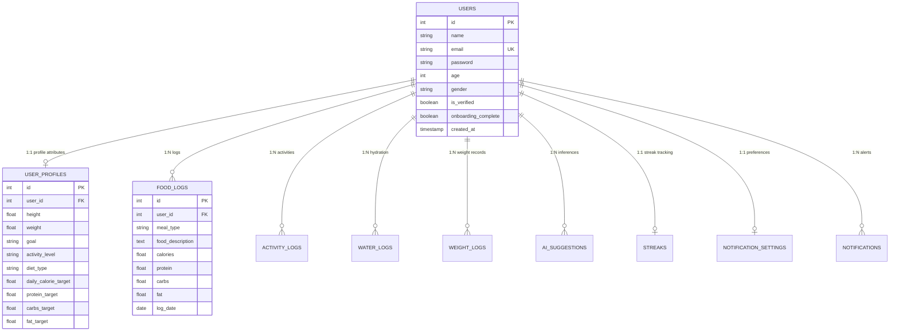

# DietDost: An Intelligent Multimodal Nutrition and Dietary Health Management System

[](https://nodejs.org/)
[](https://reactjs.org/)
[](https://vitejs.dev/)
[](https://www.postgresql.org/)
[](https://opensource.org/licenses/ISC)

---

## Abstract

**DietDost** is a full-stack, multimodal dietary tracking and nutritional intelligence platform designed to address the challenges of manual caloric logging, macronutrient adherence, and nutritional deficiency identification. By synthesizing client-side telemetry, relational persistence, and state-of-the-art Vision-Language Models (VLMs) via the Groq LPU inference engine, DietDost automates meal assessment from visual inputs, computes dynamic metabolic expenditure baselines (BMR/TDEE), and delivers real-time contextual dietary feedback. This document provides the formal architectural specification, theoretical foundations, data schema, API contract, and local replication instructions for the system.

---

## 1. System Architecture & Component Design

The system employs a decoupled, service-oriented client-server architecture with an asynchronous scheduling daemon and an external multimodal AI inference pipeline.

```
                      +-------------------------------------------------+
                      |              Client Layer (SPA)                 |
                      |  React 18 | Vite | Tailwind CSS | Chart.js      |
                      +-----------------------+-------------------------+
                                              |
                                              | HTTPS / JSON / Multipart
                                              v
                      +-------------------------------------------------+
                      |            API Gateway & Middleware             |
                      |  Express.js | CORS | JWT Auth | Multer Uploads  |
                      +-----------------------+-------------------------+
                                              |
                      +-----------------------+-------------------------+
                      |                                                 |
                      v                                                 v
+-----------------------------+                     +-----------------------------+
|    Relational Database      |                     |    External AI & Services   |
| PostgreSQL (Supabase/Local) |                     | - Groq Vision-Language API  |
| - Relational User Schemas   |                     | - Brevo SMTP / OTP Engine   |
| - Food & Activity Logs      |                     | - node-cron Job Scheduler   |
+-----------------------------+                     +-----------------------------+
```

### 1.1 Architectural Modules

1. **Presentation Layer (`/client`)**: Single-Page Application (SPA) built with React 18 and Vite. Implements reactive state management, asynchronous data fetching via Axios interceptors, responsive rendering via Tailwind CSS, and statistical time-series visualization using Chart.js.
2. **Application & Business Logic Layer (`/server`)**: Node.js and Express RESTful API responsible for user session validation, input sanitization, dynamic energy balance calculations, and controller-driven orchestration.
3. **Multimodal Inference Pipeline**: Integration with Groq High-Performance Inference APIs (`groq-sdk`) utilizing vision and language models for automated meal recognition, nutritional estimation, and deficiency analysis.
4. **Data Persistence Layer**: PostgreSQL relational schema enforcing referential integrity, foreign key constraints, cascading deletions, and indexed lookups.
5. **Background Task Scheduler**: Daemon process leveraging `node-cron` to execute automated reminder dispatching and streak state validation.

---

## 2. Theoretical Foundations & Computational Models

### 2.1 Basal Metabolic Rate (BMR) & Total Daily Energy Expenditure (TDEE)

DietDost computes baseline caloric requirements using the standardized **Mifflin-St Jeor Formula**:

$$\text{BMR}_{\text{male}} = 10 \times \text{weight (kg)} + 6.25 \times \text{height (cm)} - 5 \times \text{age (years)} + 5$$

$$\text{BMR}_{\text{female}} = 10 \times \text{weight (kg)} + 6.25 \times \text{height (cm)} - 5 \times \text{age (years)} - 161$$

Total Daily Energy Expenditure ($\text{TDEE}$) is computed by scaling $\text{BMR}$ by the Physical Activity Level factor ($\text{PAL}$):

$$\text{TDEE} = \text{BMR} \times \text{PAL}, \quad \text{PAL} \in \{1.2, 1.375, 1.55, 1.725, 1.9\}$$

Target daily caloric intake ($C_{\text{target}}$) and macronutrient distributions ($P, K, F$ in grams) are systematically allocated based on metabolic objectives:
- **Hypocaloric (Fat Loss):** $C_{\text{target}} = \text{TDEE} - 500\text{ kcal}$
- **Hypercaloric (Muscle Hypertrophy):** $C_{\text{target}} = \text{TDEE} + 300\text{ kcal}$
- **Eucaloric (Maintenance):** $C_{\text{target}} = \text{TDEE}$

### 2.2 Computer Vision-Assisted Dietary Estimation

The system processes unconstrained dietary imagery via visual tokenization. The multi-stage inference sequence executes as follows:
1. **Visual Encoding & Preprocessing:** Image ingestion via multipart stream, dimension verification, and mime-type validation.
2. **Zero-Shot Object & Portion Recognition:** Identification of food components, preparation style, and volume approximation.
3. **Macronutrient Extrapolation:** Retrieval of nutritional densities per identified constituent yielding aggregate caloric and macronutrient values:

$$\hat{C}_{\text{meal}} = \sum_{i=1}^{N} m_i \cdot \rho_{C,i}, \quad \hat{P}_{\text{meal}} = \sum_{i=1}^{N} m_i \cdot \rho_{P,i}$$

where $m_i$ denotes the estimated mass of constituent $i$, and $\rho_{C,i}, \rho_{P,i}$ represent caloric and protein densities.

---

## 3. Database Schema & Data Modeling

The relational model is formally defined within [`server/models/schema.sql`](file:///c:/Users/sajay/OneDrive/Desktop/DietDost/server/models/schema.sql).



---

## 4. Technology Stack & Dependencies

| Layer / Domain | Technology | Version | Purpose |
| :--- | :--- | :--- | :--- |
| **Frontend Framework** | React.js | `^18.2.0` | Declarative component UI engine |
| **Frontend Tooling** | Vite | `^5.2.0` | Hot Module Replacement (HMR) & bundling |
| **Styling & Animation** | Tailwind CSS / Framer Motion | `^3.4.1` / `^11.0.24` | Utility-first CSS & fluid micro-interactions |
| **Visual Analytics** | Chart.js / React-Chartjs-2 | `^4.4.2` / `^5.2.0` | Longitudinal data visual analytics |
| **Routing** | React Router DOM | `^6.30.3` | Client-side routing and route guarding |
| **Backend Runtime** | Node.js | `>=18.0.0` | Asynchronous I/O execution environment |
| **Web Framework** | Express.js | `^4.19.2` | RESTful API routing and middleware pipeline |
| **Database Engine** | PostgreSQL / `pg` driver | `^8.23.0` | ACID-compliant relational data persistence |
| **AI Inference** | Groq SDK | `^1.1.2` | Low-latency LLM and Vision multimodal inference |
| **Scheduler** | `node-cron` | `^4.2.1` | Automated task and reminder execution |
| **Communication** | Brevo API | Custom REST | Transactional email & OTP delivery |
| **Security & Auth** | `jsonwebtoken` / `bcryptjs` | `^9.0.2` / `^2.4.3` | Cryptographic hashing & stateless token auth |

---

## 5. RESTful API Specification

All protected endpoints require a valid Bearer token in the `Authorization` header: `Bearer <JWT_TOKEN>`.

### 5.1 Authentication & Profile Management

- **`POST /api/auth/register`**
  - *Payload:* `{ name, email, password }`
  - *Response:* `201 Created` | Dispatches verification OTP.
- **`POST /api/auth/verify-otp`**
  - *Payload:* `{ email, otp }`
  - *Response:* `200 OK` | Validates OTP and updates verification flag.
- **`POST /api/auth/login`**
  - *Payload:* `{ email, password }`
  - *Response:* `200 OK` | `{ token, user }`
- **`GET /api/user/profile`** [Auth]
  - *Response:* `200 OK` | Full user demographic and nutritional baseline profile.
- **`POST /api/user/onboarding`** [Auth]
  - *Payload:* Anthropometric data, lifestyle metrics, dietary restrictions, and target selections.

### 5.2 Dietary & Telemetry Logging

- **`POST /api/meal/log`** [Auth]
  - *Payload:* `{ meal_type, food_description, calories, protein, carbs, fat, log_date }`
  - *Response:* `201 Created`
- **`GET /api/meal/today`** [Auth]
  - *Response:* `200 OK` | Current day aggregated caloric intake and macro breakdown against targets.
- **`GET /api/meal/history`** [Auth]
  - *Query Params:* `startDate`, `endDate`
  - *Response:* `200 OK` | Historical time-series dietary records.

### 5.3 Multimodal AI Inference

- **`POST /api/ai/chat`** [Auth]
  - *Content-Type:* `multipart/form-data`
  - *Fields:* `message` (string), `image` (binary file, optional)
  - *Response:* `200 OK` | Context-aware nutritional analysis and automated itemization.
- **`GET /api/ai/meal-plan`** [Auth]
  - *Response:* `200 OK` | Algorithmic daily meal distribution based on macro targets.
- **`GET /api/ai/deficiency`** [Auth]
  - *Response:* `200 OK` | Diagnostic micro/macro nutrient risk assessment based on trailing logs.

### 5.4 Habit Tracking & Progress

- **`GET /api/streak`** [Auth]
  - *Response:* `200 OK` | Continuous logging streak metrics and milestones.
- **`GET /api/weight`** & **`POST /api/weight`** [Auth]
  - *Payload (POST):* `{ weight, note, log_date }`
  - *Response:* Time-series weight trajectory.

---

## 6. Installation & Execution Protocol

### 6.1 Environment Configuration

#### Backend Environment Configuration (`server/.env`)
```bash
# Server Networking
PORT=5000
NODE_ENV=development

# Database Connection URI (PostgreSQL / Supabase)
DATABASE_URL=postgresql://<user>:<password>@<host>:<port>/<database>?sslmode=require

# Cryptography
JWT_SECRET=super_secret_cryptographic_jwt_key

# Groq AI Model Configuration
GROQ_API_KEY=gsk_your_groq_api_key_here
GROQ_MODEL=groq/compound-mini
GROQ_VISION_MODEL=groq/compound-mini

# Transactional Email Engine (Brevo)
BREVO_API_KEY=your_brevo_api_key
SENDER_EMAIL=noreply@yourdomain.com
```

#### Frontend Environment Configuration (`client/.env`)
```bash
VITE_API_URL=http://localhost:5000/api
```

---

### 6.2 Local Reproduction Steps

#### 1. Clone Repository & Install Dependencies
```bash
git clone https://github.com/Ajayteli5252/DietDost.git
cd DietDost

# Install Server Dependencies
cd server
npm install

# Install Client Dependencies
cd ../client
npm install
```

#### 2. Database Migration & Initialization
Execute the schema generation script to construct all relational tables and foreign constraints:
```bash
cd ../server
node init_db.js
```

#### 3. Execution of Development Services

Open two independent terminal instances:

*Terminal 1 (Backend API Service):*
```bash
cd server
npm run dev
# Default listening port: http://localhost:5000
```

*Terminal 2 (Frontend Client Service):*
```bash
cd client
npm run dev
# Default listening port: http://localhost:5173
```

---

## 7. Security, Privacy & Compliance

1. **Authentication & Authorization**: Stateless JWT verification protocol with configurable expiration windows and claims validation.
2. **Cryptographic Protection**: Salting and one-way hashing of passwords via `bcryptjs` ($2^{10}$ iterations).
3. **Data Sanitization**: Parameterized SQL queries via the PostgreSQL driver to mitigate SQL Injection (SQLi) vulnerabilities.
4. **Media Isolation**: File uploads are restricted by MIME-type inspection (`image/jpeg`, `image/png`, `image/webp`) with hard payload size constraints (5 MB threshold).

---

## 8. Future Research Directions

- **Edge Computer Vision Deployment**: Quantization and on-device execution of lightweight vision models via WebAssembly (WASM) / ONNX Runtime.
- **Microbiome & Biomarker Integration**: Extended support for blood glucose telemetry (CGM integration) and lipid profile biomarkers.
- **Interoperability (HL7/FHIR)**: Conformance with standard healthcare interoperability protocols for clinical integration.

---

## 9. Citation & Attribution

If you utilize this project, codebase, or architectural model in academic or scientific publications, please cite as:

```bibtex
@software{dietdost2026,
  author = {DietDost Engineering Team},
  title = {DietDost: An Intelligent Multimodal Nutrition and Dietary Health Management System},
  year = {2026},
  publisher = {GitHub},
  journal = {GitHub Repository},
  howpublished = {\url{https://github.com/Ajayteli5252/DietDost}}
}
```

---

## 10. License

This project is licensed under the terms of the **ISC License**. Refer to [`server/package.json`](file:///c:/Users/sajay/OneDrive/Desktop/DietDost/server/package.json#L13) for full licensing specifications.
